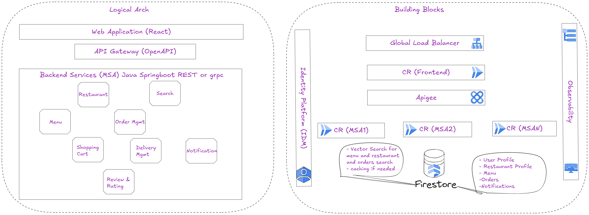

###  Solution to Cymbal eats application.
#### The solution consists of the components shown in the following diagram:

## Solution Overview

The application consists of a reactJS front end application and group of Springboot Microservices. Data is stored in Firestore and vector search is used in searching data in Firestore.
Identity Platform is used for user login and user management. APIGEE is used for API managangement and securing the API. Cloud Build is used for continous integration. All services are hosted in Cloud Rund serverless instances.

**Note: Please replace**

**For setup Code Assist**

1. In GCP Console navigate to the Admin for Gemini and enable code assist and assign subscription for the user. For more details, check the [https://cloud.google.com/gemini/docs/discover/set-up-gemini setup-Gemini-Code-Assist]
2. Install VSCode and install Gemini code assist extension on the IDE. For more details check [https://cloud.google.com/gemini/docs/codeassist/write-code-gemini Gemini Code Assist plugin]
3. Once installed login on Gemini Code Assist using the user having a code assist subscription.
4. Try it out by pressing on the Gemni Code assit icon 
5. Setup code assist tools by enabling the desired connectors (Atlasian and Github) in the GCP Console. For more details check [https://cloud.google.com/gemini/docs/codeassist/tools-agents/tools-overview Code Assist tools] Navigate to the console and search for code assis then navigate to Agents and tools and start enabling the tools and authenticating over the enabled tools.

**For setup Cloud Assist**

1. In GCP Console navigate to the Admin for Gemini and enable cloud assist and assign subscription for the user. For more details, check the [https://cloud.google.com/gemini/docs/discover/set-up-gemini setup-Gemini-Code-Assist]
2. Make sure to assign in the IAM role for the logged in user Gemini Cloud Assist User and Gemini for Google Cloud User

**For setup Jira connection**

1. In the code assist Agents and tools enable Atlassian make sure that AtlassianRovo is enabled in Jira.
2. Click connecte and authenticate on JIRA then select the connected site.

**For setup GitHub Connection**

1. To enable Code Assist PR code review, you would need to install the agent on the github repo. Please follow the steps of installation in the [https://developers.google.com/gemini-code-assist/docs/review-github-code guide]

**For Cloud Build setup**

1. Connect your Github repo cloud [https://cloud.google.com/build/docs/automating-builds/github/connect-repo-github?generation=2nd-gen#console github Cloud Build repository Gen2]
2. Create triggers for all the microservices in the repo. Please follow the [https://cloud.google.com/build/docs/automating-builds/github/build-repos-from-github?generation=2nd-gen documentation] for the setup.
